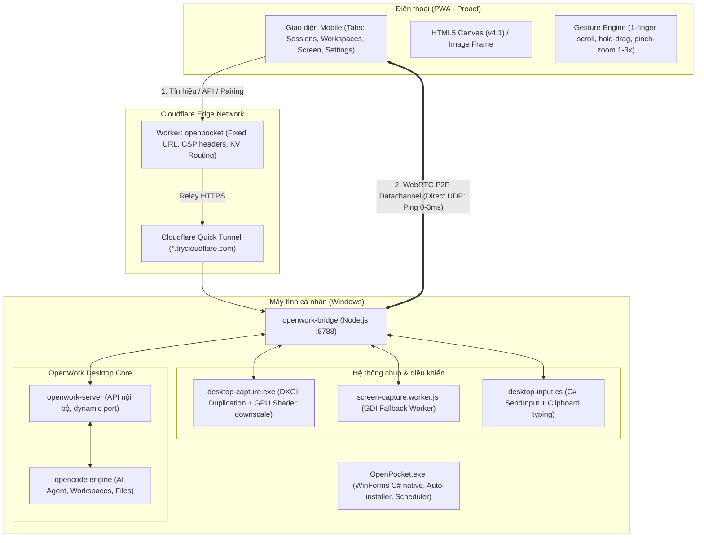

# BÁO CÁO THẨM ĐỊNH TOÀN DIỆN DỰ ÁN OPENWORK MOBILE (OPENPOCKET)

> **Thời điểm thẩm định:** 13/09/2026  
> **Dự án:** OpenWork Mobile (OpenPocket)  
> **Workspace:** `c:\Antigravity\Openwork Mobile App`  
> **Phiên bản hiện tại:** v4.0 (GPU-Direct DXGI Duplication) → v4.1 (Dirty-Rect Canvas Streaming — WIP)

---

## 1. TỔNG QUAN DỰ ÁN (EXECUTIVE SUMMARY)

OpenWork Mobile (**OpenPocket**) là giải pháp cầu nối (bridge client) cho phép người dùng điều khiển và giám sát ứng dụng AI coding agent **OpenWork Desktop** (chạy trên máy tính) trực tiếp từ điện thoại di động thông qua ứng dụng web lũy tiến (**PWA**).

### Triết lý thiết kế cốt lõi
1. **Zero-Install trên điện thoại:** Không yêu cầu cài đặt file APK/IPA hay phần mềm VPN (như Tailscale). Người dùng chỉ cần mở đường link trên trình duyệt và chọn *"Thêm vào Màn hình chính"* (Add to Home Screen).
2. **Zero-Cost ($0):** Vận hành hoàn toàn trên tầng tài nguyên miễn phí: Cloudflare Quick Tunnel + Cloudflare Workers KV Free Tier + STUN Google/Cloudflare công cộng.
3. **Mô hình 1 PC (9Remote-Style):** Tối giản hóa tối đa — máy tính tự sinh định danh ngầm (`pc-xxxxxxxx`), tạo mã ghép đôi 8 ký tự (hoặc QR code) có hạn 30 phút. Quét là kết nối, không bắt người dùng tạo tài khoản hay cấu hình mạng.

---

## 2. KIẾN TRÚC KỸ THUẬT (ARCHITECTURE)

Hệ thống được chia thành 4 phân tầng độc lập và bổ trợ lẫn nhau:



---

## 3. TIẾN ĐỘ VÀ CÁC MỐC PHÁT TRIỂN ĐÃ ĐẠT ĐƯỢC

| Phiên bản / Mốc | Tính năng & Trạng thái | Đánh giá |
|---|---|---|
| **v1.0 — Core Agent** | Kết nối `openwork-server`, quản lý Workspaces, Sessions, Chat prompt streaming, Duyệt/sửa/tải file, duyệt quyền Allow/Deny. | Hoàn thiện 100%, ổn định. |
| **v1.7 — v2.0 Screen** | Xem và điều khiển màn hình máy tính từ xa qua HTTP JPEG stream; daemon C# SendInput; gõ tiếng Việt qua Clipboard. | Hoàn thiện. |
| **v2.6 — v3.0 Touch** | Cử chỉ cảm ứng 1 ngón cuộn màn hình, giữ 0.5s để chuột phải hoặc kéo thả, pinch-zoom 1x–3x thích ứng độ phân giải (880px → 1600px). | Trải nghiệm rất mượt trên mobile. |
| **v3.1 — WebRTC P2P** | Tích hợp `node-datachannel`, bắt tay SDP/ICE qua STUN server, đẩy JPEG và lệnh điều khiển trực tiếp qua UDP. | Ping đạt 0–3ms khi cùng mạng Wi-Fi. |
| **Rút gọn 1 PC** | Loại bỏ toàn bộ hệ thống đăng nhập tài khoản/phòng; `OpenPocket.exe` tự cấp định danh và tự cài đặt `npm install`. | UX tinh giản, thân thiện với bạn bè/người không rành kỹ thuật. |
| **Chống Cloudflare 429** | Thêm `tunnel-state.json` lưu thời gian backoff qua các lần khởi động, ép IPv4/HTTP2 cho cloudflared. | Đã giải quyết tình trạng IP bị phạt lặp vòng. |
| **v4.0 — GPU Duplication** | Daemon `desktop-capture.exe` dùng DirectX 11 Desktop Duplication API + GPU Shader downscale, nén JPEG 2-thread. | Đo thực tế **36–38 fps** (tăng gấp 4 lần so với GDI). |
| **v4.1 — Dirty-Rect Update** | *(Đang phát triển dở - WIP)*: Chỉ chụp và gửi vùng màn hình thay đổi (crop JPEG) kèm header tọa độ 8 byte, vẽ đè lên `<canvas>`. | Tiết kiệm 80% băng thông và tăng FPS. |

---

## 4. CÁC VẤN ĐỀ VÀ LỖI KỸ THUẬT PHÁT HIỆN QUA THẨM ĐỊNH

> [!CAUTION]
> **Lỗi 1 (Nghiêm trọng): Lỗi biên dịch C# daemon do thiếu cờ `/unsafe`**
> * **Tệp liên quan:** [`bridge/src/desktop-capture.cs`](file:///c:/Antigravity/Openwork%20Mobile%20App/bridge/src/desktop-capture.cs#L621) và [`bridge/src/screen-dxgi.js`](file:///c:/Antigravity/Openwork%20Mobile%20App/bridge/src/screen-dxgi.js#L67).
> * **Hiện tượng:** Hàm `DiffBbox` trong `desktop-capture.cs` vừa được nâng cấp sử dụng con trỏ bộ nhớ thô (`unsafe`, `fixed (byte* a = prev, b = cur)`). Tuy nhiên, hàm biên dịch `ensureExe()` trong `screen-dxgi.js` khi gọi `csc.exe` lại **không truyền tham số `"/unsafe"`**.
> * **Hậu quả:** Trình biên dịch `csc.exe` sẽ ném lỗi:
>   ```
>   bridge\src\desktop-capture.cs(621,24): error CS0227: Unsafe code may only appear if compiling with /unsafe
>   ```
>   Do bắt lỗi compile, bridge sẽ **âm thầm hủy daemon DXGI và rơi về GDI worker cũ**, làm mất hoàn toàn hiệu năng 38fps của GPU mà người dùng không hề hay biết.

> [!WARNING]
> **Lỗi 2: Nguy cơ màn hình trắng/đen hoàn toàn khi rơi về GDI Fallback**
> * **Tệp liên quan:** [`web/src/pages/screen.jsx`](file:///c:/Antigravity/Openwork%20Mobile%20App/web/src/pages/screen.jsx#L231).
> * **Hiện tượng:** Hàm `pushFrame` trên giao diện web v4.1 mặc định cắt 8 byte đầu (`u8.subarray(8)`) để lấy tọa độ `[x, y, w, h]`. Nhưng nếu máy tính rơi vào trạng thái Fallback (màn hình khóa Windows Lock Screen, hộp thoại UAC, hoặc khi DXGI chưa compile được), GDI worker sẽ gửi trực tiếp file JPEG thô (bắt đầu bằng `0xFF, 0xD8`).
> * **Hậu quả:** Việc cắt 8 byte đầu sẽ làm đứt header JPEG magic bytes, khiến `createImageBitmap` ném ngoại lệ và Canvas trên điện thoại hoàn toàn không hiển thị được gì.

> [!NOTE]
> **Vấn đề 3: Trạng thái Cloudflare Quick Tunnel 429**
> * Hiện tại bridge đang chạy ngầm (PID 27248) và đang trong chu kỳ backoff (~5 phút) chờ Cloudflare mở lại hầm Quick Tunnel. Cần giữ nguyên trạng thái, không restart bridge.

---

## 5. GIẢI PHÁP VÀ ĐỀ XUẤT KHẮC PHỤC

### Sửa chữa Lỗi 1: Thêm `/unsafe` vào `screen-dxgi.js`
Tại file [`bridge/src/screen-dxgi.js`](file:///c:/Antigravity/Openwork%20Mobile%20App/bridge/src/screen-dxgi.js#L67):
```diff
     await execFileP(csc, [
-      "/nologo", "/target:exe", "/platform:anycpu",
+      "/nologo", "/unsafe", "/target:exe", "/platform:anycpu",
       "/r:System.Drawing.dll",
       `/out:${exe}`, join(dir, "desktop-capture.cs"),
     ]);
```

### Sửa chữa Lỗi 2: Tương thích ngược JPEG thô trong `screen.jsx`
Tại file [`web/src/pages/screen.jsx`](file:///c:/Antigravity/Openwork%20Mobile%20App/web/src/pages/screen.jsx#L231):
```javascript
  const pushFrame = useCallback((data) => {
    const u8 = data instanceof Uint8Array ? data : new Uint8Array(data);
    if (!u8 || u8.length < 4) return;

    // Nhận diện tương thích ngược: Nếu bắt đầu bằng 0xFF 0xD8 -> JPEG thô từ GDI worker
    const isRawJpeg = (u8[0] === 0xFF && u8[1] === 0xD8);
    let x = 0, y = 0, w = 0, h = 0, jpegBytes = null;

    if (isRawJpeg) {
      jpegBytes = u8;
    } else {
      if (u8.length < 9) return;
      x = u8[0] | (u8[1] << 8);
      y = u8[2] | (u8[3] << 8);
      w = u8[4] | (u8[5] << 8);
      h = u8[6] | (u8[7] << 8);
      if (!w || !h) return;
      jpegBytes = u8.subarray(8);
    }

    drawChain.current = drawChain.current.then(async () => {
      try {
        const bmp = await createImageBitmap(new Blob([jpegBytes], { type: "image/jpeg" }));
        const c = imgRef.current;
        if (c) {
          if (isRawJpeg || (x === 0 && y === 0 && (c.width !== w || c.height !== h))) {
            c.width = bmp.width;
            c.height = bmp.height;
          }
          c.getContext("2d").drawImage(bmp, x, y, isRawJpeg ? bmp.width : w, isRawJpeg ? bmp.height : h);
        }
        bmp.close?.();
        setHasFrame(true);
      } catch {}
    });
  }, []);
```

---

## 6. BẢNG ĐIỂM THẨM ĐỊNH (SCORECARD)

| Tiêu chí | Điểm | Đánh giá chi tiết |
|---|:---:|---|
| **Kiến trúc & Giải pháp** | **9.5/10** | Tận dụng xuất sắc tài nguyên hệ điều hành Windows (.NET csc, GDI, DXGI, SendInput). Tách tầng sạch sẽ giữa C#, Node.js, Cloudflare Worker và Preact. |
| **Hiệu năng & Tối ưu** | **9.0/10** | Đột phá từ 8fps lên 38fps nhờ GPU Duplication; tiết kiệm CPU nhờ phát hiện frame tĩnh; WebRTC P2P UDP đạt ping 0–3ms. |
| **Bảo mật (Security)** | **8.5/10** | Ghép đôi 30 phút, token SHA-256 hash, CSP nghiêm ngặt chống XSS trên Worker, Whitelist API không cho phép traversal. |
| **Độ hoàn thiện UX/DX** | **9.0/10** | Giao diện sao chép chuẩn mực thiết kế OpenWork desktop; hỗ trợ xoay ngang tự động, pinch-zoom thích ứng độ nét; bạn bè chỉ cần click `.exe` là dùng được. |
| **Độ ổn định code hiện tại** | **7.5/10** | Cần vá ngay 2 lỗi compile `/unsafe` và fallback Canvas ở nhánh v4.1 đang sửa dở. |

**KẾT LUẬN CHUNG:**  
Dự án có **chất lượng kỹ thuật rất cao, tư duy thiết kế thực dụng và hiệu quả**. Sau khi vá 2 lỗi ở phiên bản v4.1 nói trên, dự án sẽ đạt trạng thái hoàn thiện cực kỳ ấn tượng để đưa vào sử dụng thực tế lâu dài.
