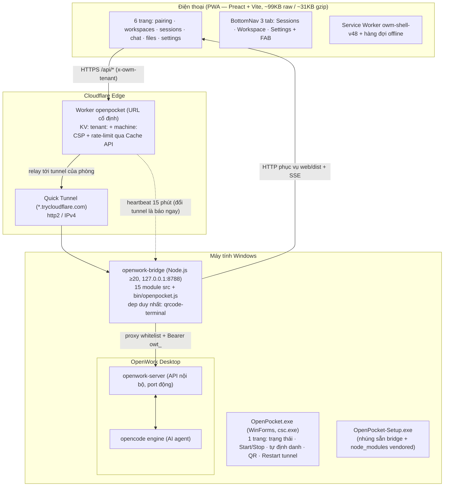

# BÁO CÁO THẨM ĐỊNH DỰ ÁN OPENWORK MOBILE (OPENPOCKET) — BẢN CẬP NHẬT 2026-10-03

> **Thời điểm thẩm định lại:** 03/10/2026
> **Dự án:** OpenWork Mobile (OpenPocket)
> **Workspace:** `c:\Antigravity\Openwork Mobile App`
> **Hiện trạng:** sau commit `fe3830f` + các thay đổi chờ commit của lượt 03/10 (review-fix pairing/worker/config, xoá nốt `bridge/VERSION`, viết lại tài liệu).
>
> ⚠️ **Bản thẩm định cũ (13/09) đã lỗi thời hoàn toàn:** nó mô tả kiến trúc DXGI/WebRTC/gesture và bảng phiên bản v1.7 → v4.1 — toàn bộ hệ thống đó đã bị GỠ khỏi dự án (`2a202a3` gỡ tính năng xem/điều khiển từ xa, `3df494d` gỡ kênh OTA). Bản này viết lại bản đồ kiến trúc theo code đang tồn tại thực tế.

---

## 1. TỔNG QUAN

OpenWork Mobile (**OpenPocket**) là cầu nối cho phép quản lý **Sessions · Workspaces · Chat · Files · Settings** của ứng dụng AI coding agent **OpenWork Desktop** (chạy trên máy tính Windows) trực tiếp từ điện thoại qua **PWA** — không cài APK, hoạt động trên cả iOS lẫn Android.

### Triết lý thiết kế (không đổi)

1. **Zero-install trên điện thoại:** mở link là dùng; "Thêm vào Màn hình chính" biến PWA thành app thật.
2. **Zero-cost ($0):** Cloudflare Quick Tunnel + Cloudflare Workers KV free tier; không STUN/TURN, không tài khoản.
3. **Mô hình 1 PC (9Remote-style):** máy tính tự sinh định danh ngầm (`pc-xxxxxxxx`), cấp mã ghép đôi 8 ký tự hạn 30 phút (hoặc QR); không tài khoản, không cấu hình mạng.
4. **Không viết lại thứ OpenWork đã có:** bridge chỉ là lớp mỏng — tìm server → giữ token → forward mặt API đã chọn + phục vụ web app.

### Bỏ khỏi dự án (đã xoá sạch, không còn trong code)

- Tính năng xem/điều khiển màn hình từ xa + stack native đi kèm (`2a202a3`): `web/src/pages/screen.jsx`, `pcs.jsx`, `bridge/src/screen.js`, `screen-dxgi.js`, `screen-capture.worker.js`, `desktop-capture.cs`, `desktop-input.cs`, `webrtc.js`, các route `/api/screen/*` + `/api/webrtc/*`, các key cấu hình TURN, và các dependency `sharp`, `node-screenshots`, `node-datachannel`.
- Kênh OTA tự cập nhật bridge (`3df494d`, hoàn tất 03/10): updater, watchdog rollback, publisher, KV release routes, file `bridge/VERSION`. **Cách phát hành duy nhất còn lại là bộ cài `OpenPocket-Setup.exe`.**
- UI đa máy trên web (13/09): form đăng nhập, keychain "Máy của tôi", link mời `#i=`.

---

## 2. BẢN ĐỒ KIẾN TRÚC HIỆN TẠI

Luồng một chiều: **Preact PWA ⇄ worker relay ⇄ bridge Node ⇄ OpenWork**.

### Phân tầng và trách nhiệm

| Tầng | Thành phần | Vai trò chính |
|---|---|---|
| **Web (PWA)** | `web/src` — 6 trang, 3 tab, `api.js` (token + phòng + keyring nội bộ), `sw.js` v48, `_headers` CSP | Ghép đôi 2 đường (mã tạm 8 ký tự / khóa vĩnh viễn + ô Phòng), chat stream theo `part.id`, swipe-to-delete, quản lý file 2 chiều, hàng đợi offline |
| **Worker relay** | `worker/src/index.js` + `scripts/tenant.mjs` | URL cố định đa phòng: KV `tenant:<id>` (tài khoản) + `machine:<id>` (tunnel hiện tại); so mật khẩu TRƯỚC khi relay; rate-limit Cache API; bọc lỗi edge thành `tunnel_down`; CSP `withSecurityHeaders` |
| **Bridge** | `bridge/src` 15 module + `bin/openpocket.js` + 9 file test | Tìm openwork-server (engine-instances → netstat → /health), bootstrap token owt_, proxy whitelist + SSE keepalive, pairing 9Remote, Quick Tunnel + backoff 429 (state persist qua `tunnel-state.json`), heartbeat 15', logwipe, fslist, CLI start/stop/status/autostart/watchdog/ensure |
| **Desktop GUI + bộ cài** | `desktop/src/OpenPocket.cs` (~60KB exe) + `OpenPocketSetup.cs` + `build-setup.js` | 1 trang quản trị (chạy Administrator), tự định danh phòng qua `/api/tenant/create`, QR ghép đôi, close-to-tray; bộ cài 1 file nhúng sẵn `bridge/node_modules` (vendored) — máy bạn bè không chạy npm |
| **OpenWork** | openwork-server + opencode engine | Nguồn sự thật của sessions/workspaces/files; bridge chỉ forward, không tái phát minh API |

---

## 3. TIẾN ĐỘ PHÁT TRIỂN — BẢN ĐỒ MỚI

| Mốc | Nội dung | Trạng thái |
|---|---|---|
| **Core agent (v1)** | Kết nối openwork-server; Workspaces (tạo + Browse thư mục), Sessions (list/create/delete, stream realtime, Stop button), Chat (model bắt buộc, permission Allow/Deny), Files (xem/sửa/tải lên/xuống, PDF), PWA offline queue | Hoàn thiện, ổn định |
| **Đa phòng v1.7** | Worker KV tenant/machine, mã mời, đăng nhập web | UI đã rút gọn còn API dormant (13/09) |
| **Rút gọn 1 PC (13/09)** | Bỏ đăng nhập/phòng/keychain UI; exe tự định danh ngầm; CLI trim còn 8 lệnh | Hoàn thiện |
| **Chống Cloudflare 429 (13/09)** | cloudflared http2/IPv4, backoff persist `tunnel-state.json`, báo "tunnel_down" kèm ETA, Restart tunnel thủ công | Hoàn thiện |
| **Gỡ remote control (`2a202a3`)** | Xóa toàn bộ stack xem/điều khiển + native deps; web còn Sessions/Workspace/Chat/Files/Settings | Đã xoá sạch (grep 0) |
| **Gỡ OTA (`3df494d` + 03/10)** | Xóa updater/watchdog/publisher/KV release/`bridge/VERSION`; `bridge/package.json` là nguồn version duy nhất | Đã xoá sạch |
| **Vá độ bền + hardening (03/10)** | `1d96865` 10 vá bridge + test tĩnh/auth; `efe2a5f` dọn export chết + 25 test web thật; `e5e4571` SafeInvoke/timeout/kill đúng tiến trình/báo lỗi provision; `616238c` vendor qrcode-terminal vào bộ cài + assert dist mới; `fe3830f` sửa state-lie UI + dọn CSS chết + bump sw v48; working tree: ô Phòng, `pairingBaseUrl()`, viết lại 4 file tài liệu | Hoàn thiện |

---

## 4. HIỆN TRẠNG KIỂM THỬ (đã chạy 03/10/2026)

| Lệnh (env `OPENWORK_BRIDGE_DIR`/`OPENWORK_DIR` trỏ `%TEMP%`) | Kết quả |
|---|---|
| `cmd /c npm --prefix bridge test` | **36 pass / 0 fail** (9 file: auth, bridge, config, listener, lookup, pairing, startup, static, tunnel) |
| `cmd /c npm --prefix web test` | **25 pass / 0 fail** (keyring 10 + hợp đồng lỗi 15) |
| `node --test worker/test/*.test.mjs` | **11 pass / 0 fail** (KV/fetch mock) |
| `npm --prefix web run build` | OK — JS 78.846 B (26.633 B gzip), CSS 19.901 B (4.620 B gzip) |
| `grep -rniE "turnkey|turntoken|webrtc|dxgi|screen" bridge/src/ worker/src/index.js` | Rỗng — stack đã gỡ không còn dấu vết trong code chạy |

Lưu ý: chưa chạy build exe GUI trong lượt tài liệu này (lượt trước đã kiểm chứng compile `OpenPocket.cs` bằng csc.exe C# 5 — 0 lỗi 0 cảnh báo, 59.904 byte).

---

## 5. VẤN ĐỀ CÒN MỞ

1. `FindNodeExe()` trong `desktop/src/OpenPocket.cs` còn 1 chỗ `WaitForExit()` không timeout trên `where.exe` — thực tế nhanh, chưa vá.
2. Comment route trong `web/src/app.jsx:20` vẫn chép mục "Máy của tôi" đã bị xoá khỏi UI — chỉ là comment, chưa sửa (ngoài phạm vi file `.md`).
3. CSP production chưa được kiểm chứng trên môi trường deploy thật (`_headers` + `withSecurityHeaders` mới verify ở build cục bộ).
4. Chat outbox và chống xung đột file chưa có regression test — việc riêng, chưa thuộc lượt nào.
5. Bề mặt API dormant (`/api/pair/tenant`, `/api/tenant/create`) còn sống không UI; KV free tier đủ ~10 phòng.
6. Phòng tạo trước 13/09 với mật khẩu mặc định `12345678` cần re-key thủ công (revoke + add).

---

## 6. NHẬN ĐỊNH

- **Kiến trúc:** phân tầng sạch PWA ⇄ Worker ⇄ Bridge ⇄ OpenWork; sau khi gỡ stack remote control + OTA, mọi module còn lại đều có bổ nhiệm rõ ràng và được test bao quanh (72 test tổng: 36 + 25 + 11).
- **Độ bền:** các bẫy từng gây sự cố thật (retry vô hạn, rò khoá qua stdout, fan-out roomless, treo UI thread, kill nhầm tiến trình, dist cũ) đều đã vá kèm regression test.
- **Phát hành:** một artifact duy nhất — `OpenPocket-Setup.exe` nhúng sẵn node_modules; dist cũ bị chặn bởi assert mtime; OTA đã bỏ nên "update" = phát bộ cài mới.
- **Điểm cần theo dõi:** 6 mục còn mở ở trên, trong đó đáng lưu ý nhất là O3 (CSP production) và O1 (WaitForExit không timeout).
